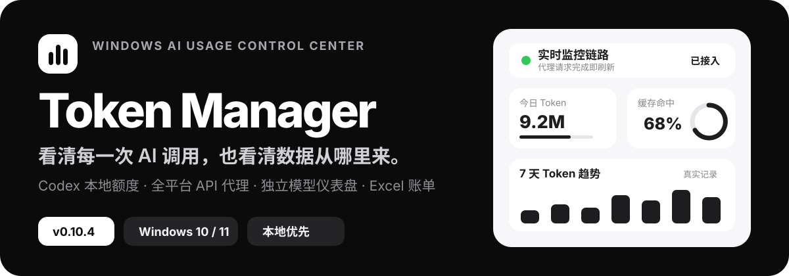
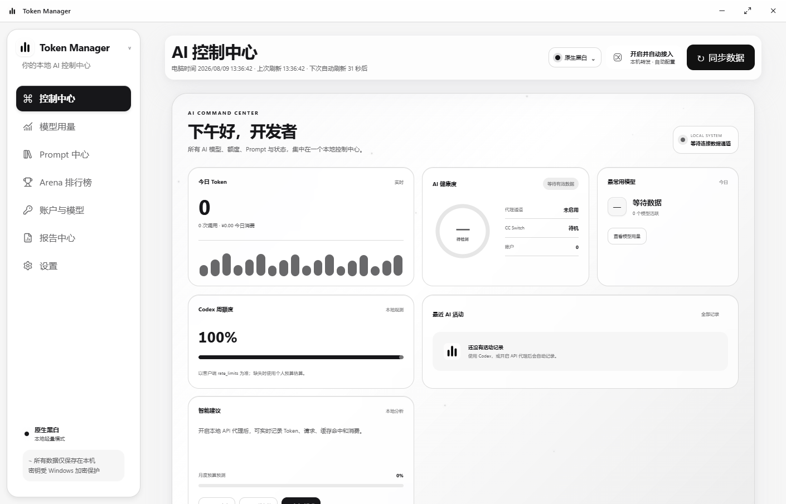
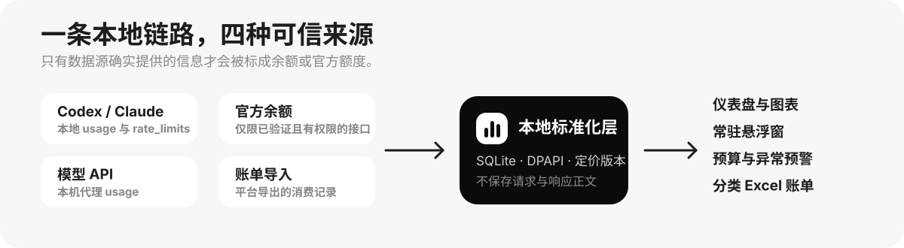
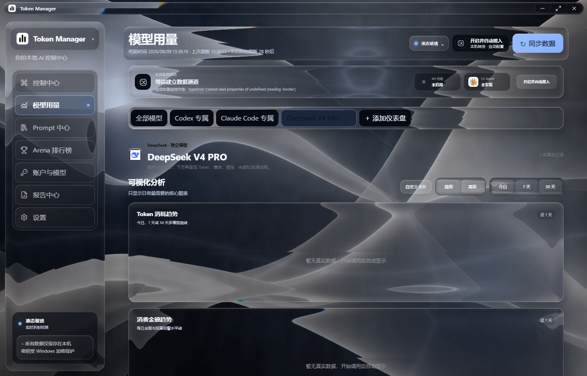
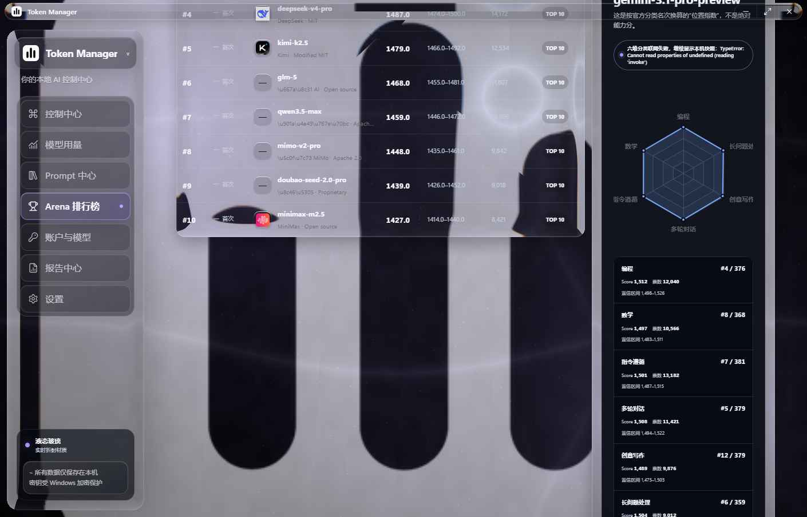
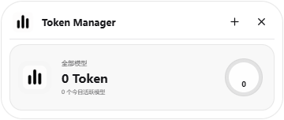
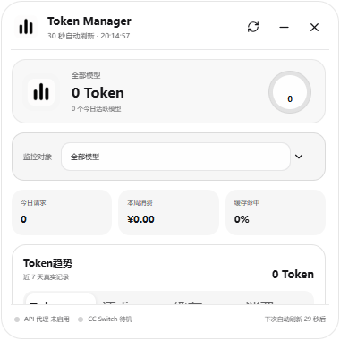

<p align="center">
  
</p>

<p align="center">
  <a href="https://fatimabentz691-max.github.io/HUSSEL/">官方网站</a> ·
  <a href="https://github.com/fatimabentz691-max/HUSSEL/releases/tag/v0.10.4">GitHub Release</a> ·
  <a href="https://fatimabentz691-max.github.io/HUSSEL/downloads/TokenManager_0.10.4_x64-setup.exe">下载安装包</a> ·
  <a href="https://fatimabentz691-max.github.io/HUSSEL/downloads/TokenManager_0.10.4_x64-portable.exe">下载便携版</a> ·
  <a href="./docs/USER_GUIDE.md">使用手册</a>
</p>

<p align="center">
  <strong>Windows 10/11 x64</strong> · Tauri 2 · Vue 3 · Rust · SQLite · Windows DPAPI
</p>

Token Manager 是面向 AI 开发者的本地用量控制中心。它把 Codex、Claude Code、本机 API 代理、官方余额接口与账单导入统一为可核对的 Token、请求、缓存、余额和人民币成本数据，并明确标注每项数据究竟来自客户端、本地观测、官方接口还是个人预算估算。

## 先看真实界面

<p align="center">
  
</p>

这不是静态演示数据页面。代理请求完成后会立即推送用量更新，普通日志、账户余额和模型统计每 30 秒同步；没有真实记录的图表会显示空状态，不会填充模拟数字。

## v0.10.4 能做什么

- **Codex 专属监控**：读取客户端本地 `rate_limits`、5 小时/7 天窗口、重置时间和本地 Token 记录，不读取或复用 `auth.json`。
- **Claude Code 专属仪表盘**：从本地 JSONL 提取模型、时间与 `usage` 元数据，不保存提示词或回复正文。
- **全平台本机代理**：统一记录输入、输出、缓存 Token、请求次数、HTTP 状态和成本；OpenAI、Anthropic、Gemini、DeepSeek 与 OpenAI 兼容格式已进入标准化链路。
- **独立模型仪表盘**：每个平台、账户和模型只显示自己的数据，支持今日/7 天/30 天图表、鼠标悬停明细和卡片拖动布局。
- **DeepSeek V4 PRO 深度统计**：流式 `usage`、模型别名归档、人民币计价、官方 `/user/balance` 余额及余额变化记录。
- **常驻悬浮窗**：恢复 v0.8.5 双形态布局，支持拖动、缩放、置顶、折叠、模型切换与迷你图表；v0.10.4 起永久保持交互，并使用 Windows 原生区域精确裁切圆角。
- **报告中心**：按全部模型或单个平台/模型生成真正的 `.xlsx` 工作簿。
- **Arena 排行榜**：展示公开榜单日期、排名、置信信息和六维分类位置；离线时使用最近缓存并明确标注。
- **本地资产与迁移**：API Key 使用当前 Windows 用户的 DPAPI 加密，可单条删除、批量清空或导出加密迁移包。
- **可选云账户**：邮箱密码、邮箱验证码与一次性加密迁移链接均为可选能力；核心监控无需登录即可使用。

<p align="center">
  
</p>

## 数据边界：余额就是余额，估算就是估算

| 数据 | v0.10.4 的显示规则 |
| --- | --- |
| Codex 5 小时 / 7 天额度 | 优先显示客户端落盘的 `rate_limits` 百分比与重置时间；客户端没有下发的窗口明确标为“个人预算估算” |
| DeepSeek 余额 | 使用已验证的官方 `/user/balance` 返回值，区分总余额、充值余额与赠送余额 |
| API Token / 请求 / 缓存 | 仅在调用经过本机代理且上游实际返回 `usage` 时记录；失败请求仍可计入请求次数 |
| OpenAI / Anthropic / Gemini 账单 | 普通模型 API Key 不会被冒充为组织账单权限；缺少官方权限时只显示本机代理统计 |
| 国产云平台账单 | 根据平台能力使用本机代理、官方账单接口或账单导入；未核实接口时不伪造实时余额 |
| Arena 排名 | 使用公开结构化榜单与本地缓存，不根据 Token Manager 本机用量自行改写官方名次 |

完整说明见 [数据来源与准确性](./docs/DATA_SOURCES.md)。

## 模型仪表盘、Arena 与悬浮窗

<p align="center">
  
</p>

<p align="center">
  
</p>

<table>
  <tr>
    <td width="50%" align="center"></td>
    <td width="50%" align="center"></td>
  </tr>
  <tr>
    <td align="center"><strong>折叠胶囊</strong><br>当前模型、Token 与环形指标</td>
    <td align="center"><strong>经典展开</strong><br>模型切换、摘要、图表与链路状态</td>
  </tr>
</table>

## 支持的平台

客户端日志：**Codex、Claude Code、Cursor**。

开放平台：**腾讯混元、豆包、文心千帆、通义百炼、智谱 AI、DeepSeek、Kimi、小米 MiMo、讯飞星火、MiniMax、阶跃星辰、零一万物、商汤日日新、百川智能、OpenAI、Anthropic、Google Gemini**，以及自定义 OpenAI 兼容服务。

“可以添加平台”不代表普通模型 API Key 一定拥有官方余额或账单权限。界面会为每个账户标明当前数据来源与可用能力。

## 下载 v0.10.4

| 文件 | 用途 | 大小 | SHA-256 |
| --- | --- | ---: | --- |
| [`TokenManager_0.10.4_x64-setup.exe`](https://fatimabentz691-max.github.io/HUSSEL/downloads/TokenManager_0.10.4_x64-setup.exe) | 推荐，Windows 安装包 | 9.96 MiB | `C529D48CCF2FFF4E51E2013F0670CFEAA20149650C2FBE0C17BCAB226AF6BEF2` |
| [`TokenManager_0.10.4_x64-portable.exe`](https://fatimabentz691-max.github.io/HUSSEL/downloads/TokenManager_0.10.4_x64-portable.exe) | 便携运行 | 21.03 MiB | `5315A18C5F9506F4A645F3120D1F42071B0D4D13B08FF46FB94EF8C43FCAAE4D` |

> [!WARNING]
> v0.10.4 尚未配置商业代码签名，Windows 可能显示“未知发布者”。请只从本仓库 Release 或上方官方网站下载并核对 SHA-256。覆盖安装前先从托盘彻底退出旧版 Token Manager，避免安装程序无法写入正在运行的 EXE。

### 三分钟接入 API 代理

1. 在“账户与模型”中选择平台，填写账户名称、官方 Base URL 与 API Key。
2. 点击“一键开启 API 实时监控”，复制软件分配的 `http://127.0.0.1:<端口>/v1` 地址。
3. 把调用工具的 Base URL 改为该本机地址；API Key 仍由 Token Manager 使用 DPAPI 加密保存。
4. 发起一次真实请求。请求结束后 Token、请求次数、缓存与成本会立即写入仪表盘。

## 隐私与本地存储

- 默认不上传 API Key、会话正文、提示词、回复、工具参数或本地日志正文。
- API Key 使用 Windows DPAPI 绑定当前用户加密，数据库位于 `%LOCALAPPDATA%\Token Manager\token-manager.db`。
- 本地代理只监听 `127.0.0.1`，不向局域网开放。
- 可选账户后端只用于登录与加密迁移，不是使用本地监控的前置条件。
- 导出的诊断与迁移数据由用户主动触发；迁移包使用用户设置的密码再次加密。

## 从源码运行

要求：Node.js 20+、Rust stable、Visual Studio 2022“使用 C++ 的桌面开发”、WebView2 Runtime。

```powershell
npm install
npm run dev
```

启动完整 Tauri 桌面端：

```powershell
npm exec tauri dev
```

验证并生成 NSIS 安装包：

```powershell
npm run build
cargo test --manifest-path src-tauri/Cargo.toml
npm exec tauri build
```

v0.10.4 已通过 Vue 生产构建、11 项 Rust 单元测试、100%–200% DPI 悬浮窗检查、真实 Win32 鼠标拖动和原生圆角区域命中测试。

## 项目结构

```text
src/                  Vue 3 主界面、图表、报告、Arena 与悬浮窗
src/features/         主题、图表、动画、悬浮窗与云端配置
src-tauri/src/        Rust 数据库、DPAPI、代理、日志解析、Excel 与托盘
docs/                 安装、使用、数据来源、安全与扩展文档
assets/readme/        README 的 SVG 视觉系统与真实 v0.10.4 截图
website/              产品官网源代码
```

## 文档

- [安装与卸载](./docs/INSTALLATION.md)
- [普通用户使用手册](./docs/USER_GUIDE.md)
- [数据来源与准确性](./docs/DATA_SOURCES.md)
- [日志与密钥安全](./docs/logs-and-security.md)
- [新增平台适配器规范](./docs/adapter-development.md)
- [悬浮窗内部架构](./docs/FLOATING_WINDOW_V3.md)
- [更新记录](./CHANGELOG.md)
- [参与贡献](./CONTRIBUTING.md)

## 商标、许可与关联声明

Token Manager 是独立的第三方本地工具，与 README 中提及的平台不存在隶属、合作或官方背书关系。平台名称与标志仅用于识别用户自行配置的服务，权利归各自所有者。

Token Manager 桌面客户端源码采用 [MIT License](./LICENSE) 开源。你可以使用、修改与再分发代码，但供应商 Logo、产品名称与第三方商标仍归各自权利人所有，使用时请遵守对应品牌规范。
